## Requerimentos

- Docker
- Docker compose

O projeto foi testado nas seguintes plataformas:

- Windows 11 x86 (bare metal)
- macOS Sonoma arm (bare metal)
- Ubuntu 25.04 arm (VM)

## Execução

Basta clonar o repositório, abrir a pasta do protocolo desejado no terminal, e executar o script run.sh. (Executar o script em escopo diferente da pasta do protocolo vai causar erro)

É necessário que todos os scripts tenham EOL padrão UNIX (LF), caso a codificação mude para CRLF no seu ambiente, é necessário recodificar todos os scripts com LF.

Nota: Devido ao volume de configurações e testes realizados no script de execução, os daemons que simulam os protocolos podem se perder, principalmente no protocolo EIGRP que tem implementação menos robusta que o OSPF no [FRR](https://frrouting.org/). Caso ocorra, o script ficará preso no passo de convergência das tabelas de roteamento (mais do que alguns segundos no EIGRP, ou alguns minutos no OSPF). Basta cancelar a execução e rodar novamente até funcionar.

## Estrutura do projeto

    docs : Documentos, diagramas, gráficos, etc.
    router : Configurações, simulações e testes    
    |
    |-> eigrp : Protocolo de roteamento
    |   |
    |   |-> config : Configurações de cada roteador
    |   |   |-> rN : Onde N é o número do roteador em questão
    |   |       |-> Dockerfile : Arquivo docker para orquestrar o container
    |   |       |-> network-setup.sh : Configuração padrão do roteador de acordo com a Cisco para o protocolo em questão
    |   |
    |   |-> logs : Vários arquivos coletando métricas da rede e cada roteador
    |   |-> compose.yml : Arquivo docker para orquestrar os roteadores e as redes, chamado pelo script run.sh
    |   |-> dispose.sh : Script para terminar os containers
    |   |-> run.sh : Script para inicializar os containers, executar testes e coletar métricas
    |
    |-> ospf : Segue a mesma estrutura do eigrp

## Topologia simulada
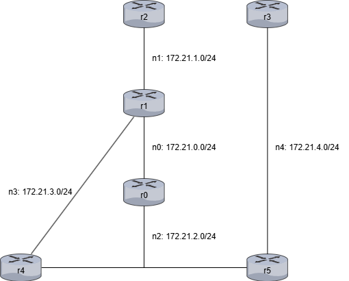

Roteadores/Containers: r0-r5

Redes: n0-n4

Os endereços de IP vão sempre seguir o mesmo padrão:

    172.21.X.1Y

Onde X é o número da rede (0-4), e Y é o número do roteador (0-5).

Por exemplo, O IP da interface de rede do roteador r5 que conecta na rede n1 é 172.21.1.15.

## Como foi configurado?

Para montar a topologia foi utilizado Docker. Com uso do docker compose é possível subir cada um dos roteadores, configurar as redes, ips, e conexões de interfaces exatamente como no diagrama abaixo. A simulação dos roteadores foi feita com [FRR](https://frrouting.org/), um fork moderno e bem reconhecido do Quagga.

### Docker Compose:

Temos dois arquivos compose no projeto, um para OSPF, outro para EIGRP.

    services: <-- Aqui temos cada um dos containers/roteadores, abaixo há o r0 como exemplo
      r0: <-- Nome do roteador
      cap_add: <-- Adiciona as capacidades requeridas pelo FRR
        - NET_ADMIN
        - NET_RAW
        - SYS_ADMIN
      stdin_open: true <-- Torna o container interativo
      tty: true <-- Torna o container interativo
      build:
        context: config/r0 <-- indica onde está a Dockerfile para subir o container
      networks: <-- Configura as redes que o roteador pertence
        n0:
          ipv4_address: 172.21.0.10 <-- Configura o ip do roteador em cada rede que ele pertence
        n2:
          ipv4_address: 172.21.2.10 <-- Configura o ip do roteador em cada rede que ele pertence
          .
          .
          .

    networks: <-- Configura as redes do docker
      n0: <-- Nome da Rede
      driver: bridge <-- Tipo de rede padrão do docker
      ipam:
        config:
          - subnet: 172.21.0.0/24 <-- IP e máscara da rede
          .
          .
          .

### Dockerfile:

A Dockerfile é chamada pelo compose, abaixo temos a do r0 como exemplo.

Na primeira linha temos o FROM, que indica a imagem utilizada. A imagem utilizada aqui é disponibilizada pelo FRR e consiste de um linux alpine com o setup básico para rodar o FRR.

    FROM quay.io/frrouting/frr@sha256:c26f183a7ac0ece17565bc147d2e7126d6f24a55b178c6a5275b4902b921692b

    WORKDIR /
    COPY network-setup.sh network-setup.sh <-- Copia o script de setup do roteador
    RUN chmod +x ./network-setup.sh <-- Habilita permissão de execução no script
    
    RUN apk update && apk add sudo
    RUN sudo apk add nano
    RUN sudo apk add sed
    RUN sudo apk add shadow
    RUN sudo apk add openrc
    RUN sudo usermod -a -G frrvty frr <-- Até aqui instala alguns pacotes básicos para uso do usuário e do FRR
    
    RUN sed -i 's/eigrpd=no/eigrpd=yes/g' etc/frr/daemons <-- Modifica o arquivo de daemons do FRR, habilitando somente o protocolo que será testado

    RUN touch ./etc/frr/vtysh.conf <-- Cria arquivo de configuração da shell de acesso ao roteador para evitar flooding de logs de arquivo não existente

### network-setup.sh:

O setup do roteador é bem simples. 'vtysh' é a shell que acessa o terminal do roteador, tendo os mesmos conformes da Cisco. Cada roteador tem um script próprio de setup para cada protocolo, e todos os scripts do mesmo protocolo têm os mesmos passos, diferindo apenas nas redes configuradas.

Cada '-c' é seguido de uma linha de comando no terminal, assim temos:

EIGRP r0

    #!/bin/sh
    vtysh -c 'conf t' -c 'router eigrp 1 vrf default' -c 'network 172.21.0.10/24' -c 'network 172.21.2.10/24' -c 'end'

- conf t
- router eigrp 1 vrf default
- network 172.21.0.10/24
- network 172.21.2.10/24
- end

OSPF r0

    #!/bin/sh
    vtysh -c 'conf t' -c 'router ospf vrf default' -c 'network 172.21.0.10/24 area 0' -c 'network 172.21.2.10/24 area 0' -c 'end'

- conf t
- router ospf vrf default
- network 172.21.0.10/24 area 0
- network 172.21.2.10/24 area 0
- end

### run.sh:

Esse é o script principal do projeto, existindo um para cada protocolo. Dentro dele temos:
- Chamada do compose
- Aplicação dos scripts network-setup.sh em cada roteador
- Cálculo da convergência
- Coleta de várias informações interessantes, como a tabela de roteamento IP, tabela do protocolo, topologia, interfaces, vizinhos, etc.
- Execução dos testes e coleta dos dados de desempenho
- Finalização do processo, com prompt para terminar os containers ou deixar eles de pé

Dentro dos scripts run há comentários explicando mais a fundo os passos realizados em cada protocolo.

## Análise

### Tabelas de roteamento

<table>
<tr>
<td>
</td>
<td>
OSPF
</td>
<td>
EIGRP
</td>
</tr>

<tr>
<td>
show ip route
</td>
<td>

```
Codes: K - kernel route, C - connected, L - local, S - static,
       R - RIP, O - OSPF, I - IS-IS, B - BGP, E - EIGRP, N - NHRP,
       T - Table, v - VNC, V - VNC-Direct, A - Babel, F - PBR,
       f - OpenFabric, t - Table-Direct,
       > - selected route, * - FIB route, q - queued, r - rejected, b - backup
       t - trapped, o - offload failure

IPv4 unicast VRF default:
K>* 0.0.0.0/0 [0/0] via 172.21.0.1, eth0, weight 1, 00:00:54
O   172.21.0.0/24 [110/10] is directly connected, eth0, weight 1, 00:00:53
C>* 172.21.0.0/24 is directly connected, eth0, weight 1, 00:00:54
L>* 172.21.0.10/32 is directly connected, eth0, weight 1, 00:00:54
O>* 172.21.1.0/24 [110/20] via 172.21.0.14, eth0, weight 1, 00:00:07
O   172.21.2.0/24 [110/10] is directly connected, eth1, weight 1, 00:00:53
C>* 172.21.2.0/24 is directly connected, eth1, weight 1, 00:00:54
L>* 172.21.2.10/32 is directly connected, eth1, weight 1, 00:00:54
O>* 172.21.3.0/24 [110/30] via 172.21.0.14, eth0, weight 1, 00:00:02
  *                        via 172.21.2.11, eth1, weight 1, 00:00:02
O>* 172.21.4.0/24 [110/20] via 172.21.2.11, eth1, weight 1, 00:00:07
```

</td>
<td>

```
Codes: K - kernel route, C - connected, L - local, S - static,
       R - RIP, O - OSPF, I - IS-IS, B - BGP, E - EIGRP, N - NHRP,
       T - Table, v - VNC, V - VNC-Direct, A - Babel, F - PBR,
       f - OpenFabric, t - Table-Direct,
       > - selected route, * - FIB route, q - queued, r - rejected, b - backup
       t - trapped, o - offload failure

IPv4 unicast VRF default:
K>* 0.0.0.0/0 [0/0] via 172.21.0.1, eth0, weight 1, 00:00:05
E   172.21.0.0/24 [90/28160] is directly connected, eth0, weight 1, 00:00:04
C>* 172.21.0.0/24 is directly connected, eth0, weight 1, 00:00:05
L>* 172.21.0.10/32 is directly connected, eth0, weight 1, 00:00:05
E>* 172.21.1.0/24 [90/30720] via 172.21.0.14, eth0, weight 1, 00:00:03
E   172.21.2.0/24 [90/28160] is directly connected, eth1, weight 1, 00:00:04
C>* 172.21.2.0/24 is directly connected, eth1, weight 1, 00:00:05
L>* 172.21.2.10/32 is directly connected, eth1, weight 1, 00:00:05
E>* 172.21.3.0/24 [90/33280] via 172.21.0.14, eth0, weight 1, 00:00:02
  *                          via 172.21.2.11, eth1, weight 1, 00:00:02
E>* 172.21.4.0/24 [90/30720] via 172.21.2.11, eth1, weight 1, 00:00:04
```

</td>
</tr>

<tr>
<td>
show ip ospf/eigrp route/topology
</td>
<td>

```
============ OSPF network routing table ============
N    172.21.0.0/24         [10] area: 0.0.0.0
                           directly attached to eth0
N    172.21.1.0/24         [20] area: 0.0.0.0
                           via 172.21.0.14, eth0
N    172.21.2.0/24         [10] area: 0.0.0.0
                           directly attached to eth1
N    172.21.3.0/24         [30] area: 0.0.0.0
                           via 172.21.0.14, eth0
                           via 172.21.2.11, eth1
N    172.21.4.0/24         [20] area: 0.0.0.0
                           via 172.21.2.11, eth1

============ OSPF router routing table =============

============ OSPF external routing table ===========
```

</td>
<td>

```
EIGRP Topology Table for AS(1)/ID(172.21.2.10)

Codes: P - Passive, A - Active, U - Update, Q - Query, R - Reply
       r - reply Status, s - sia Status

P  172.21.0.0/24, 1 successors, FD is 28160, serno: 0 
       via Connected, eth0
P  172.21.1.0/24, 1 successors, FD is 30720, serno: 0 
       via 172.21.0.14 (30720/28160), eth0
P  172.21.2.0/24, 1 successors, FD is 28160, serno: 0 
       via Connected, eth1
P  172.21.3.0/24, 2 successors, FD is 33280, serno: 0 
       via 172.21.0.14 (33280/30720), eth0
       via 172.21.2.11 (33280/30720), eth1
P  172.21.4.0/24, 1 successors, FD is 30720, serno: 0 
       via 172.21.2.11 (30720/28160), eth1
```

</td>
</tr>

<tr>
<td>
show ip ospf/eigrp neighbor
</td>
<td>

```
Neighbor ID     Pri State           Up Time         Dead Time Address         Interface                        RXmtL RqstL DBsmL
172.21.1.14       1 Full/Backup     12.433s           33.424s 172.21.0.14     eth0:172.21.0.10                     0     0     0
172.21.4.11       1 Full/DR         17.378s           32.622s 172.21.2.11     eth1:172.21.2.10 
```

</td>
<td>

```
EIGRP neighbors for AS(1)

H   Address           Interface            Hold   Uptime   SRTT   RTO   Q     Seq  
                                           (sec)           (ms)        Cnt    Num   
0   172.21.0.14       eth0                 12     0        0      2    0      3
0   172.21.2.11       eth1                 11     0        0      2    0      4
```

</td>
</tr>

<tr>
<td>
show ip ospf/eigrp interface
</td>
<td>

```
eth0 is up
  ifindex 3115, MTU 1500 bytes, BW 10000 Mbit <UP,LOWER_UP,BROADCAST,RUNNING,MULTICAST>
  Internet Address 172.21.0.10/24, Broadcast 172.21.0.255, Area 0.0.0.0
  MTU mismatch detection: enabled
  Router ID 172.21.2.10, Network Type BROADCAST, Cost: 10
  Transmit Delay is 1 sec, State DR, Priority 1
  Designated Router (ID) 172.21.2.10 Interface Address 172.21.0.10/24
  Backup Designated Router (ID) 172.21.1.14, Interface Address 172.21.0.14
  Multicast group memberships: OSPFAllRouters OSPFDesignatedRouters
  Timer intervals configured, Hello 10s, Dead 40s, Wait 40s, Retransmit 5
    Hello due in 4.142s
  Neighbor Count is 1, Adjacent neighbor count is 1
  Graceful Restart hello delay: 10s
  LSA retransmissions: 7
eth1 is up
  ifindex 3109, MTU 1500 bytes, BW 10000 Mbit <UP,LOWER_UP,BROADCAST,RUNNING,MULTICAST>
  Internet Address 172.21.2.10/24, Broadcast 172.21.2.255, Area 0.0.0.0
  MTU mismatch detection: enabled
  Router ID 172.21.2.10, Network Type BROADCAST, Cost: 10
  Transmit Delay is 1 sec, State Backup, Priority 1
  Designated Router (ID) 172.21.4.11 Interface Address 172.21.2.11/24
  Backup Designated Router (ID) 172.21.2.10, Interface Address 172.21.2.10
  Multicast group memberships: OSPFAllRouters OSPFDesignatedRouters
  Timer intervals configured, Hello 10s, Dead 40s, Wait 40s, Retransmit 5
    Hello due in 4.142s
  Neighbor Count is 1, Adjacent neighbor count is 1
  Graceful Restart hello delay: 10s
  LSA retransmissions: 0
```

</td>
<td>

```
EIGRP interfaces for AS(1)

Interface        Bandwidth  Delay      Peers  Xmit Queue   Mean    Pacing Time    Multicast    Pending  Hello    Holdtime
                                              Un/Reliable  SRTT    Un/Reliable    Flow Timer   Routes  
eth0             100000     10         1      0 / 0         0       0              0            0       5        15       
eth1             100000     10         1      0 / 0         0       0              0            0       5        15       
```

</td>
</tr>
</table>

### Convergência

OSPF | EIGRP
:-:|:-:
 | 

### Latência e Delay

OSPF n1 | EIGRP n1 | OSPF n3 | EIGRP n3
:-:|:-:|:-:|:-:
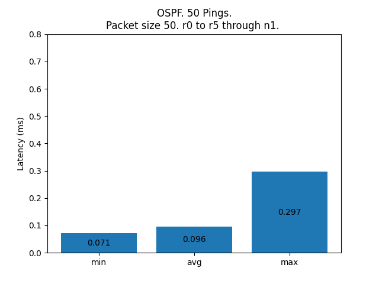 |  | 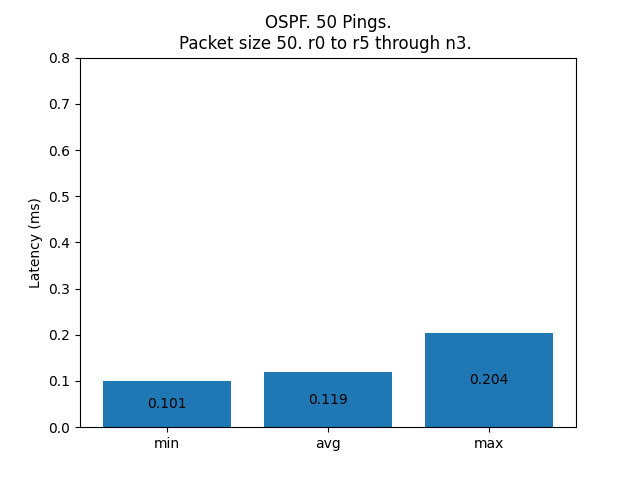 | 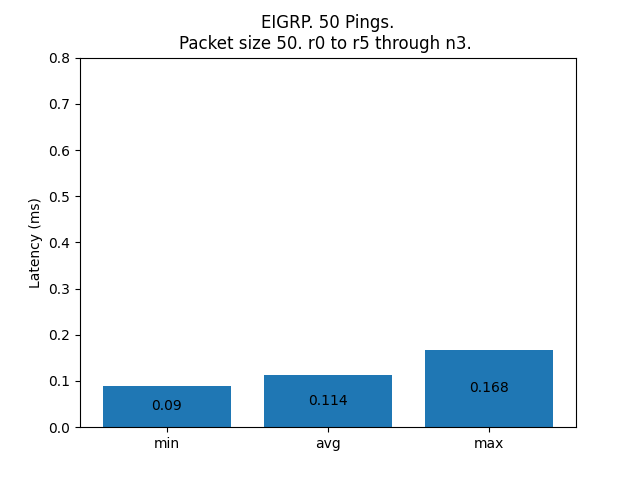
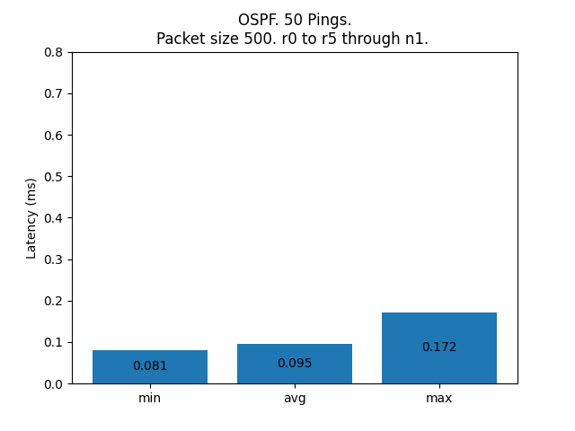 | 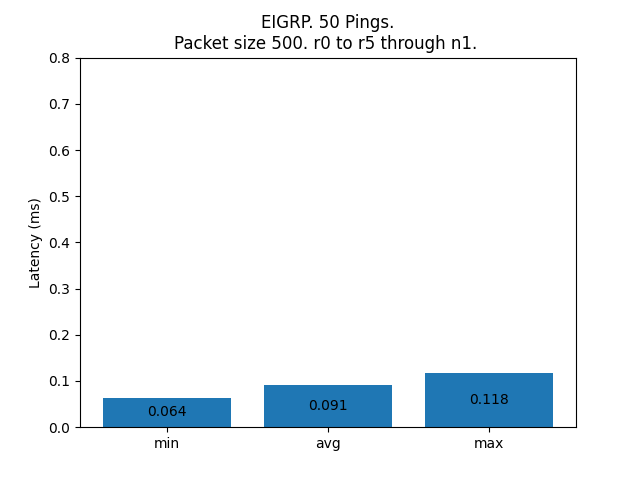 | 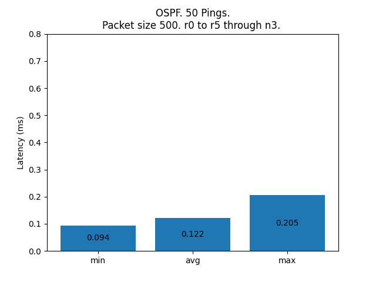 | 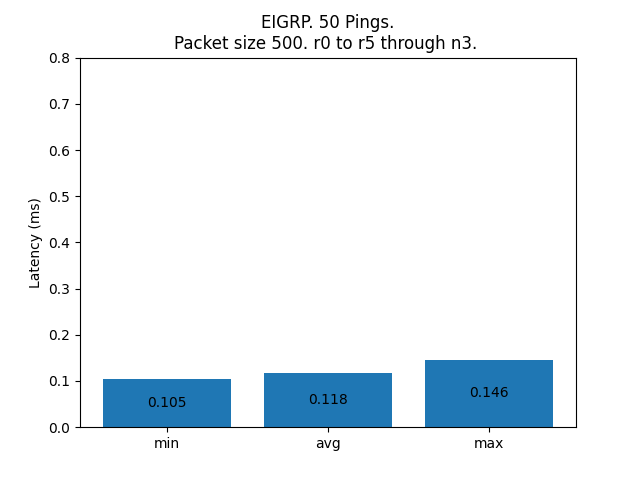
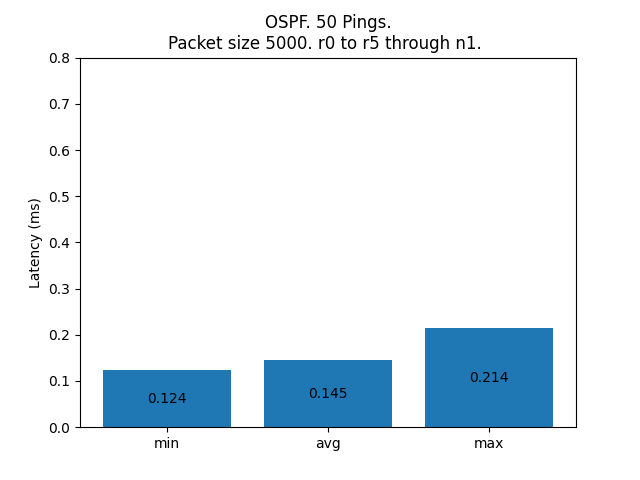 | 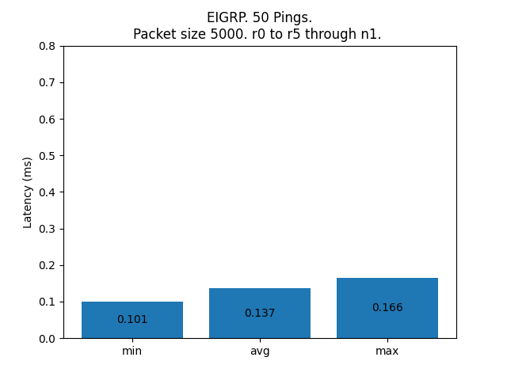 | 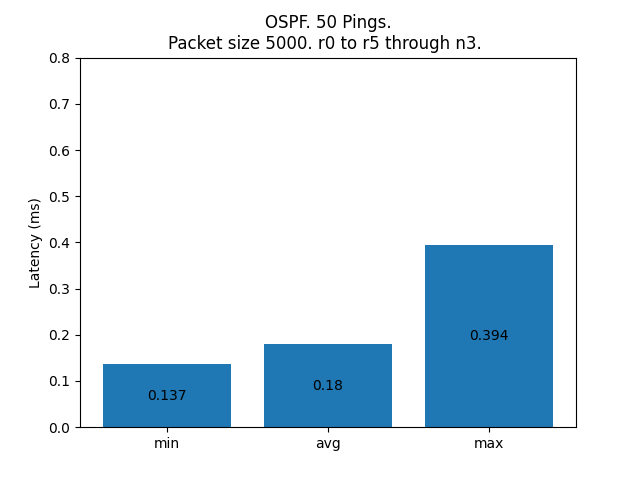 | 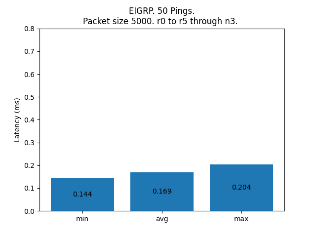

### Pacotes de roteamento

OSPF | EIGRP 
:-:|:-:
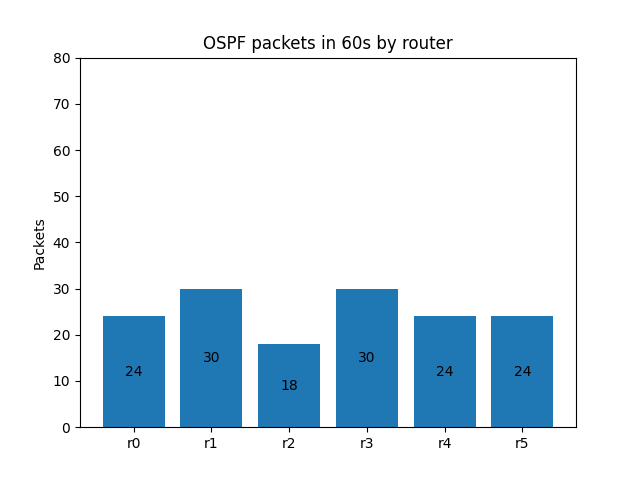 | 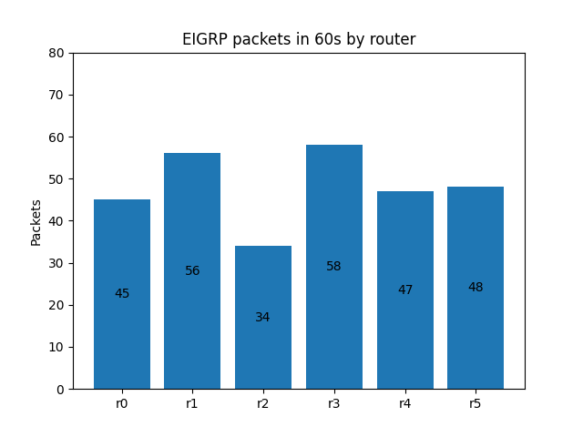