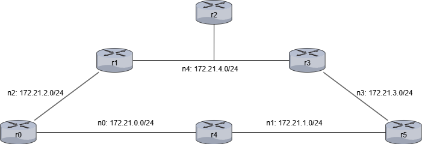

## Requerimentos

- Docker
- Docker compose

O projeto foi testado nas seguintes plataformas:

- Windows 11 x86 (bare metal)
- macOS Sonoma arm (bare metal)
- Ubuntu 25.04 arm (VM)

## Execução

Basta clonar o repositório, abrir a pasta do protocolo desejado no terminal, e executar o script run.sh. (Executar o script em escopo diferente da pasta do protocolo vai causar erro)

Nota: Devido ao volume de configurações e testes realizados no script de execução, os daemons que simulam os protocolos podem se perder, principalmente no protocolo EIGRP que tem implementação menos robusta que o OSPF no [FRR](https://frrouting.org/). Caso ocorra, o script ficará preso no passo de convergência das tabelas de roteamento (mais do que alguns segundos no EIGRP, ou alguns minutos no OSPF). Basta cancelar a execução e rodar novamente até funcionar.

## Estrutura do projeto

    docs : Documentos, diagramas, gráficos, etc.
    router : Configurações, simulações e testes    
    |
    |-> eigrp : Protocolo de roteamento
    |   |
    |   |-> config : Configurações de cada roteador
    |   |   |-> rN : Onde N é o número do roteador em questão
    |   |       |-> Dockerfile : Arquivo docker para orquestrar o container
    |   |       |-> network-setup.sh : Configuração padrão do roteador de acordo com a Cisco para o protocolo em questão
    |   |
    |   |-> logs : Vários arquivos coletando métricas da rede e cada roteador
    |   |-> compose.yml : Arquivo docker para orquestrar os roteadores e as redes, chamado pelo script run.sh
    |   |-> dispose.sh : Script para terminar os containers
    |   |-> run.sh : Script para inicializar os containers, executar testes e coletar métricas
    |
    |-> ospf : Segue a mesma estrutura do eigrp

## Topologia simulada

Roteadores/Containers: r0-r5

Redes: n0-n4

Os endereços de IP vão sempre seguir o mesmo padrão:

    172.21.X.1Y

Onde X é o número da rede (0-4), e Y é o número do roteador (0-5).

Por exemplo, O IP da interface de rede do roteador r5 que conecta na rede n1 é 172.21.1.15.

## Como foi configurado?

Para montar a topologia foi utilizado Docker. Com uso do docker compose é possível subir cada um dos roteadores, configurar as redes, ips, e conexões de interfaces exatamente como no diagrama abaixo. A simulação dos roteadores foi feita com [FRR](https://frrouting.org/), um fork moderno e bem reconhecido do Quagga.

Temos dois arquivos compose no projeto, um para OSPF, outro para EIGRP:

### Docker Compose:
    services: <-- Aqui temos cada um dos containers/roteadores, abaixo há o r0 como exemplo
      r0: <-- Nome do roteador
      cap_add: <-- Adiciona as capacidades requeridas pelo FRR
        - NET_ADMIN
        - NET_RAW
        - SYS_ADMIN
      stdin_open: true <-- Torna o container interativo
      tty: true <-- Torna o container interativo
      build:
        context: config/r0 <-- indica onde está a Dockerfile para subir o container
      networks: <-- Configura as redes que o roteador pertence
        n0:
          ipv4_address: 172.21.0.10 <-- Configura o ip do roteador em cada rede que ele pertence
        n2:
          ipv4_address: 172.21.2.10 <-- Configura o ip do roteador em cada rede que ele pertence
          .
          .
          .

    networks: <-- Configura as redes do docker
      n0: <-- Nome da Rede
      driver: bridge <-- Tipo de rede padrão do docker
      ipam:
        config:
          - subnet: 172.21.0.0/24 <-- IP e máscara da rede
          .
          .
          .

### Dockerfile

A Dockerfile é chamada pelo compose, abaixo temos a do r0 como exemplo.

Na primeira linha temos o FROM, que indica a imagem utilizada. A imagem utilizada aqui é disponibilizada pelo FRR e consiste de um linux alpine com o setup básico para rodar o FRR.

    FROM quay.io/frrouting/frr@sha256:c26f183a7ac0ece17565bc147d2e7126d6f24a55b178c6a5275b4902b921692b

    WORKDIR /
    COPY network-setup.sh network-setup.sh <-- Copia o script de setup do roteador
    RUN chmod +x ./network-setup.sh <-- Habilita permissão de execução no script
    
    RUN apk update && apk add sudo
    RUN sudo apk add nano
    RUN sudo apk add sed
    RUN sudo apk add shadow
    RUN sudo apk add openrc
    RUN sudo usermod -a -G frrvty frr <-- Até aqui instala alguns pacotes básicos para uso do usuário e do FRR
    
    RUN sed -i 's/eigrpd=no/eigrpd=yes/g' etc/frr/daemons <-- Modifica o arquivo de daemons do FRR, habilitando somente o protocolo que será testado

    RUN touch ./etc/frr/vtysh.conf <-- Cria arquivo de configuração da shell de acesso ao roteador para evitar flooding de logs de arquivo não existente

### network-setup.sh

O setup do roteador é bem simples. 'vtysh' é a shell que acessa o terminal do roteador, tendo os mesmos conformes da Cisco. Cada roteador tem um script próprio de setup para cada protocolo, e todos os scripts do mesmo protocolo têm os mesmos passos, diferindo apenas nas redes configuradas.

Cada '-c' é seguido de uma linha de comando no terminal, assim temos:

EIGRP r0

    #!/bin/sh
    vtysh -c 'conf t' -c 'router eigrp 1 vrf default' -c 'network 172.21.0.10/24' -c 'network 172.21.2.10/24' -c 'end'

- conf t
- router eigrp 1 vrf default
- network 172.21.0.10/24
- network 172.21.2.10/24
- end

OSPF r0

    #!/bin/sh
    vtysh -c 'conf t' -c 'router ospf vrf default' -c 'network 172.21.0.10/24 area 0' -c 'network 172.21.2.10/24 area 0' -c 'end'

- conf t
- router ospf vrf default
- network 172.21.0.10/24 area 0
- network 172.21.2.10/24 area 0
- end

### run.sh

Esse é o script principal do projeto, existindo um para cada protocolo. Dentro dele temos:
- Chamada do compose
- Aplicação dos scripts network-setup.sh em cada roteador
- Cálculo da convergência
- Coleta de várias informações interessantes, como a tabela de roteamento IP, tabela do protocolo, topologia, interfaces, vizinhos, etc.
- Execução dos testes (aplicando as alterações necessárias para cada um) e coleta dos dados de desempenho
- Finalização do processo, com prompt para terminar os containers ou deixar eles de pé